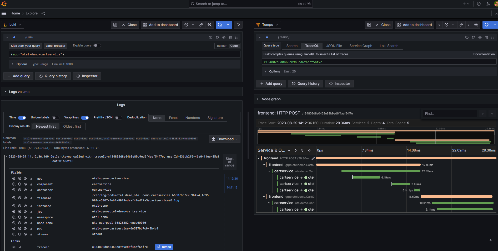
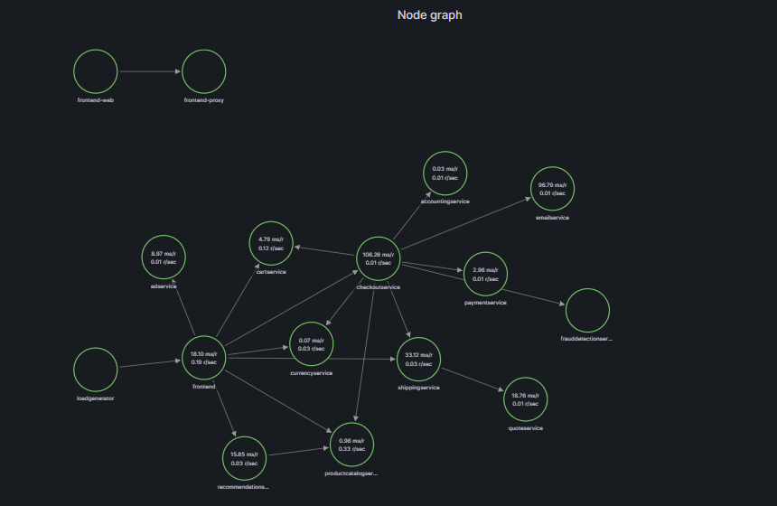

## OpenTelemetry Demo
This repo is adapted from the [OpenTelemetry Demo](https://github.com/open-telemetry/opentelemetry-demo). Helm was chosen to deploy the demo. 

We added LGTM as the Tracing backend and also modified the CartService by adding TraceId in the log entries so that you can jump to Grafana Tempo (traces) from Grafana Loki (logs).
### Resources
- [Doc](https://opentelemetry.io/docs/demo/kubernetes-deployment/)
- [GitHub Repo](https://github.com/open-telemetry/opentelemetry-demo)
- [Helm Chart Repo](https://github.com/open-telemetry/opentelemetry-helm-charts/tree/main/charts/opentelemetry-demo)


### Instructions
To install:
```sh
helm repo add open-telemetry https://open-telemetry.github.io/opentelemetry-helm-charts
helm repo update
helm install otel-demo open-telemetry/opentelemetry-demo \
  --values ./otel-demo-values.yaml \
  --namespace otel-demo \
  --create-namespace
```

To access the demo and view instrumentation
```sh
# port forwarding 
kubectl port-forward svc/otel-demo-frontendproxy 9080:8080
kubectl port-forward svc/otel-demo-otelcol 4318:4318
```
URLs
- Web store: <http://localhost:9080/>
- Grafana: <http://localhost:9080/grafana/>
- Feature Flags UI: <http://localhost:9080/feature/>
- Load Generator UI: <http://localhost:9080/loadgen/>
- Jaeger UI: <http://localhost:9080/jaeger/ui/>


### Customized CartService
- Added logging
- Use my personal Docker hub repo to store the image

To build and push the custom cartservice image:
```sh
# TODO: Had to copy Dockerfile to the root folder
docker build -t peishu/cartservice:v01 .
docker push peishu/cartservice:v01
```

### Work with Distributed Tracing in Grafana Tempo
To view logs, open the Grafana UI (from your LGTM stack) and select `Loki` from the data sources dropdown. Run the following query:
```
{app="otel-demo-cartservice"}
```
then expand one of the log entries with "...with traceId=xxxxxx..." and you should see a `Tempo` button in the Links section. Click on the Tempo button will open the Tempo tracing panel side by side with Loki:



You can also view the `Node graph` from Tempo by selecting the `Service Graph` tab and click on `Run queyr`:



To clean up
```sh
helm -n otel-demo uninstall otel-demo
```